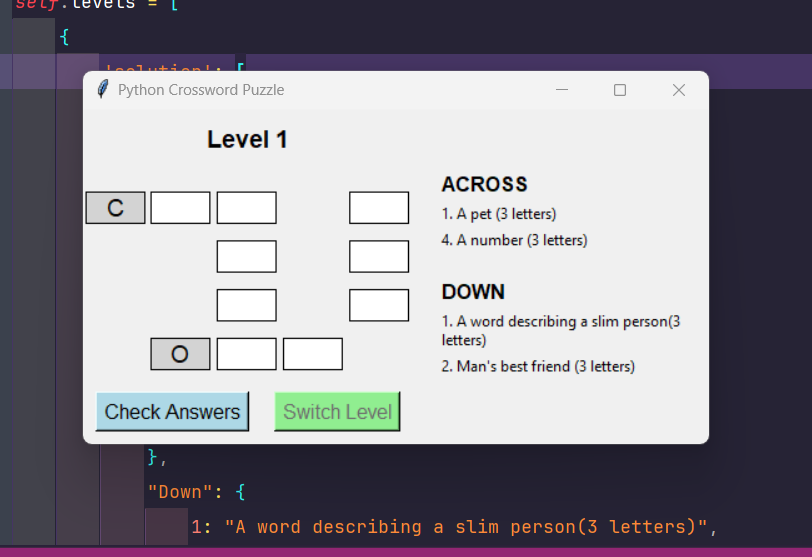
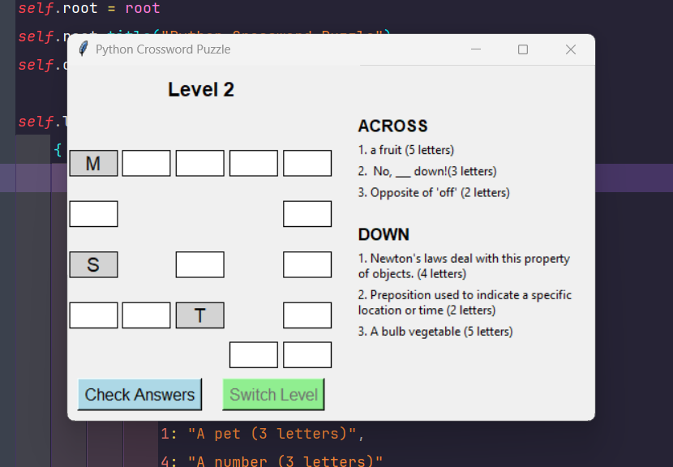

# Simple Crossword Puzzle Game

This is a Python-based crossword puzzle game built using the Tkinter library. It offers multiple levels of crossword puzzles, each with a unique set of clues and solutions. The game automatically checks the answers and provides feedback.

## Features

* Multiple crossword puzzle levels.
* Validates letter input (only accepts alphabetic characters).
* Automatically converts input to uppercase.
* Pre-filled letters for some cells.
* Instant feedback on correct and incorrect answers.
* Switch to the next level upon successful completion.

## Prerequisites

* Python 3.x
* Tkinter (usually comes pre-installed with Python)

## Installation

Clone the repository and navigate to the project directory:

```
git clone https://github.com/yourusername/simple-crossword.git
cd simple-crossword
```

## Running the Game

Execute the script using Python:

```
python simple_crossword.py
```

## How to Play

1. Enter the letters into the cells based on the given clues.
2. The input is automatically converted to uppercase.
3. Press 'Check Answers' to validate your responses.
4. If correct, you can proceed to the next level.

## Screenshot





## Contributing

Feel free to submit issues or fork the repository and make pull requests.

## License

This project is licensed under the MIT License.
